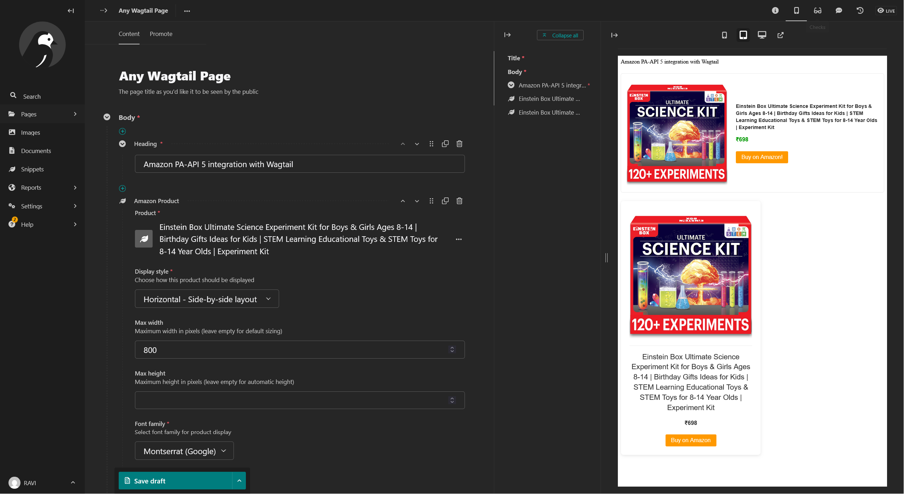
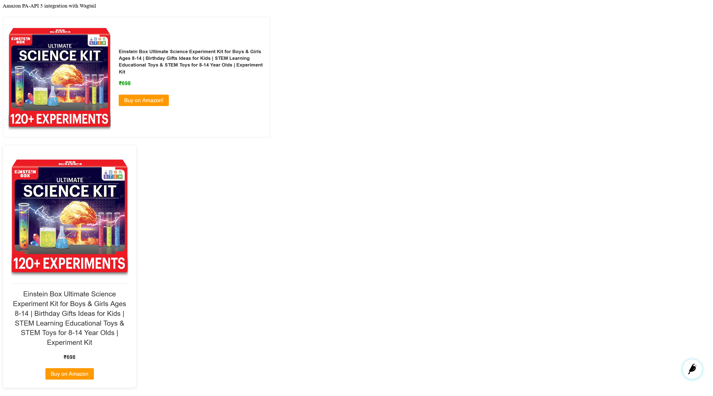

# wagtail-amazon-paapi
##### Wagtail Amazon PA-API Integration
This package provides integration between Wagtail CMS and Amazon's Product Advertising API (PA-API), allowing you to display Amazon products on your Wagtail site with affiliate links.

Note: This project is not affiliated with or endorsed by Amazon. Use of the AWS Product Advertising API is subject to Amazon Associates Program Policies. 

## Features

- Store Amazon product data as snippets in Wagtail
- Fetch product details directly from Amazon's PA-API
- Display products with customizable styling in your Wagtail pages
- Update product information with a single click

## Installation

> ⚠️ **Note:** This package is not yet available on PyPI due to pending verification of the Amazon API integration. For now, you must install from the local source.

### Local Installation

Clone the repository and install it locally:

```bash
# Clone the repository
git clone https://github.com/yourusername/wagtail-amazon-paapi.git
cd wagtail-amazon-paapi

# Install in development mode
pip install -e .
```

Or install directly from your local copy:

```bash
pip install -e /path/to/wagtail-amazon-paapi
```

Add it to your `INSTALLED_APPS`:

```python
INSTALLED_APPS = [
    # ...
    'wagtail_amazon_paapi',
    # ...
]
```

## Configuration

Add your Amazon PA-API credentials to your Django settings:

```python
# Amazon PA-API credentials
WAGTAIL_AMAZON_PRODUCTS = {
    'AMAZON_PAAPI_ACCESS_KEY': 'YOUR_ACCESS_KEY',  # Use environment variables for security
    'AMAZON_PAAPI_SECRET_KEY': 'YOUR_SECRET_KEY',  # Use environment variables for security
    'AMAZON_PAAPI_PARTNER_TAG': 'your-associate-tag',  # Your tracking ID
    'AMAZON_PAAPI_COUNTRY': 'US',  # Country code for the Amazon marketplace
}
```

Run migrations:

```bash
python manage.py migrate
```

## Using Amazon Product Snippets

### Creating Product Snippets

1. In the Wagtail admin, navigate to "Snippets" and select "Amazon Products"
2. Click "Add Amazon Product"
3. Enter an ASIN (Amazon Standard Identification Number)
4. Fill in product details manually or update from Amazon API
5. Save the snippet

### Adding Products to Pages

1. Edit a page with a StreamField
2. Add an "Amazon Product" block
3. Select your product from the dropdown
4. Configure display options
5. Save the page

## Customization Options

When adding Amazon product blocks to your pages, you can fully customize their appearance:

### Display Styles

Choose from three layout styles:
- **Simple** - Clean minimal design
- **Card** - Boxed layout with shadow
- **Horizontal** - Side-by-side layout

### Size Controls

Set exact dimensions to fit your design:
- **Max Width** - Control the width in pixels
- **Max Height** - Limit height with automatic overflow

### Typography Options

Fully customize text appearance:
- **Font Family** - Choose from web-safe fonts or Google Fonts
- **Title Size** - Small, medium, or large options
- **Title Weight** - Normal or bold
- **Title Color** - Custom color for the product title
- **Price Color** - Custom color for the price display
- **Button Text** - Customize the call-to-action text


*Screenshot: Configuring an Amazon product block in the Wagtail admin*


*Screenshot: Example of Amazon product blocks with different styles*

## Current Limitations

**Package Status:**
> ⚠️ **Important:** This package is currently in development and not available on PyPI. The primary reason is that the automatic product updates feature has an issue with Amazon API rate limits. Manual entry of product details is fully functional and demonstrated in this package. The automatic update functionality needs further verification before public release. This will be addressed in a future update, or contributions to verify this functionality are welcome.

## Extending

You can override the default templates by creating your own versions at:
- `templates/wagtail_amazon_paapi/blocks/amazon_product_snippet.html`
- `templates/wagtail_amazon_paapi/admin/panels/amazon_update_panel.html`

## License

This project is licensed under the MIT License.

## Credits and License

- **Author**: [Ravi Gupta](mailto:ravi.opensource@protonmail.com)  
- **License**: [MIT](https://opensource.org/licenses/MIT)  

This project is not affiliated with or endorsed by Amazon. Use of the AWS Product Advertising API is subject to Amazon Associates Program Policies. 
